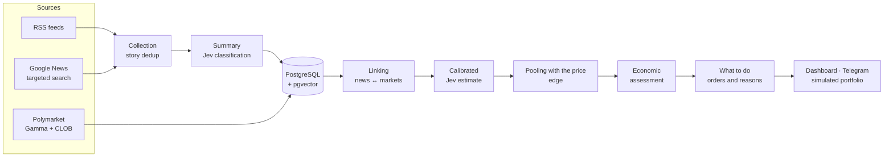

<div align="center">

# News × Markets

**From news to probabilities: a news aggregator that estimates the events listed on [Polymarket], compares the estimate with the price and says what is worth doing.**

[](https://github.com/botta0oss/News_Aggregator/actions/workflows/tests.yml)


**English** · [Italiano](README.it.md)

[Features](#features) · [How it works](#how-it-works) · [Quick start](#quick-start) · [Going online](#going-online) · [Documentation](#documentation)

<br>

<picture>
  <source media="(prefers-color-scheme: dark)" srcset="docs/images/overview-dark.png">
  
</picture>

</div>

> [!WARNING]
> **This is not financial advice.** The app does not place orders: it produces suggestions to be checked.
> Before using real money, check the results over many resolved markets
> ([backtest and calibration](docs/verification.md)).
>
> **The human speaking now:** this thing is 1000% vibe-coded; I wanted to test the latest AI
> models and TypeSafe AI's Jev to see what these new technologies can do. Do not trust this web
> app to make financial decisions or place bets. Use the simulated portfolio inside the app if
> you want to see how it performs.

## In short

News × Markets collects news from RSS feeds and targeted searches, classifies it with
[TypeSafe Jev](https://typesafe.ai) and links it to Polymarket markets. For each market Jev
estimates the probability of the outcome without seeing the price; the estimate, corrected with
past results and weighted by the strength of the news, is compared with the price.

When there is an edge, the app turns it into a **concrete plan**: whether to buy, with which
limit order, how much to stake, when to sell, and **why or why not**. A simulated portfolio,
the backtest and the calibration measure whether the signals really work.

The dashboard is available in **English and Italian** (IT/EN button at the top right).

## Features

<table>
<tr>
<td width="50%" valign="top">

### 📰 News
- RSS sources managed from the dashboard, with a catalogue of recommended sources
- Targeted Google News search for the most traded markets
- Story-level deduplication: confirmations are counted per outlet, not per article
- Summaries (Gemini, Groq, Ollama) and classification with Jev
- Full-text search with highlighting and filters

</td>
<td width="50%" valign="top">

### 🎯 Forecasts
- News–market linking: meaning (multilingual embeddings) + key terms
- Jev's independent estimate, without seeing the price
- Platt calibration and log-odds pooling with the price
- Yes/No markets and **multi-outcome** ones (elections, leagues), with arbitrage flagged
- Telegram alerts when a news item gets ahead of the price

</td>
</tr>
<tr>
<td valign="top">

### 💶 Decisions
- Real price from the order book, fees, uncertainty, annualised return
- Kelly computed on the book, with three risk presets
- **What to do**: buy, wait, avoid, hold or sell, with limit orders
- Prices at which the decision would change, and an explicit selling rule
- Reasons for and against, with a confidence level

</td>
<td valign="top">

### 📊 Measurement
- Simulated portfolio with automatic buys and sells
- Backtest on resolved markets, with archive news free of hindsight
- Confidence intervals and validation on the most recent markets
- Closing line value (CLV) of signals, bets and alerts
- Usage and cost of the paid APIs, with daily limits

</td>
</tr>
</table>

## A look at the dashboard

<table>
<tr>
<td width="50%" align="center">
<picture>
  <source media="(prefers-color-scheme: dark)" srcset="docs/images/strategy-dark.png">
  
</picture>
<br><b>What to do</b>: orders, prices and reasons
</td>
<td width="50%" align="center">
<picture>
  <source media="(prefers-color-scheme: dark)" srcset="docs/images/multi-dark.png">
  
</picture>
<br><b>Multi-outcome</b>: the distribution, outcome by outcome
</td>
</tr>
<tr>
<td align="center">
<picture>
  <source media="(prefers-color-scheme: dark)" srcset="docs/images/portfolio-dark.png">
  
</picture>
<br><b>Simulated portfolio</b>: results before real money
</td>
<td align="center">
<picture>
  <source media="(prefers-color-scheme: dark)" srcset="docs/images/backtest-dark.png">
  
</picture>
<br><b>Backtest</b>: how it would have gone in the past
</td>
</tr>
</table>

<sub>Screenshots with demo data. Light and dark themes follow your GitHub settings.</sub>

## How it works



1. **Collection.** News comes from RSS feeds and targeted searches; the same story rewritten
   by several outlets becomes a single entry, with the number of outlets confirming it.
2. **Linking.** Each market gets the news about the same subject, chosen by relevance,
   source reliability and freshness.
3. **Forecast.** Jev reads the market rules and the news and estimates the probability without
   seeing the price. The estimate is calibrated on markets already resolved and pooled with the
   price, with a weight that grows with the strength of the news.
4. **Decision.** Real price from the book, fees, uncertainty, time and risk limits say whether
   it is worth it, how much to stake and at what price to sell.
5. **Verification.** Simulated portfolio, backtest, calibration and closing price say whether
   the edge is real.

Details and formulas: [The method](docs/method.md) · [Strategy and portfolio](docs/strategy.md).

## Quick start

**With Docker** (recommended). You need at least a [TypeSafe](https://typesafe.ai) key for forecasts.

```bash
git clone https://github.com/botta0oss/News_Aggregator.git && cd News_Aggregator
cp .env.example .env          # set at least TYPESAFE_API_KEY and POSTGRES_PASSWORD
docker compose up --build
docker compose exec api python -m backend.auth.cli create-user yourname --role admin
```

Open **http://localhost:8000** and sign in with the user you just created. Compose also starts
Postgres with pgvector; on the first start news collection and market sync begin right away.
To open it from your phone or another computer at home see
[Use on your home network](docs/deploy.md#local-use-and-home-network).

> [!TIP]
> With a local NVIDIA GPU:
> `docker compose -f docker-compose.yml -f docker-compose.gpu.yml up --build`.
> Without a GPU the default image uses CPU-only PyTorch, much lighter.
> See [Docker images](docs/deploy.md#docker-images-cpu-or-gpu).

<details>
<summary><b>Without Docker</b></summary>

<br>

You need PostgreSQL with the [pgvector](https://github.com/pgvector/pgvector) extension.

```bash
python -m venv .venv && source .venv/bin/activate
pip install torch --index-url https://download.pytorch.org/whl/cpu   # only without a GPU
pip install -r requirements.txt
cp .env.example .env        # set DATABASE_URL and the keys
python -m backend.auth.cli create-user yourname --role admin
uvicorn backend.main:app --reload
```

`python scripts/check_env.py` checks which keys are configured and whether the database
answers. Tables are created at startup and updated by idempotent migrations.

</details>

## Going online

The cheapest way: a small VPS with Docker and **Cloudflare Tunnel** for HTTPS, with no open
ports and no certificates to manage. Compose includes the tunnel and a daily database backup.

| | Indicative cost |
|---|---|
| VPS with 2 vCores, 4 GB RAM (OVH VPS-1, Hetzner…) | about €4–6 a month |
| Cloudflare Tunnel, HTTPS, domain managed by Cloudflare | free (the domain is paid separately) |
| Summaries with Gemini or Groq, Telegram, Polymarket, Google News | free tiers |
| Forecasts with Jev (TypeSafe) | pay per use, with [daily limits](docs/costs.md) |

Step-by-step guide: **[Deploy on a VPS with Cloudflare Tunnel](docs/deploy.md#deploy-on-a-vps-with-cloudflare-tunnel)**.

## Essential configuration

Everything is set in `.env` (a copy of [`.env.example`](.env.example)). The most important:

| Variable | What it is for |
|---|---|
| `TYPESAFE_API_KEY` | Forecasts and classification with Jev. Without it: heuristic classification and no forecasts |
| `GEMINI_API_KEY` / `GROQ_API_KEY` | News summaries (free tiers) |
| `POSTGRES_PASSWORD` | Database password in compose, to choose before the first start |
| `DAILY_JEV_CALL_LIMIT`, `DAILY_AI_BUDGET_USD` | Daily cap on calls and spend |
| `PREDICTION_AUTO` | Automatic forecasts after every collection (off by default) |
| `TELEGRAM_BOT_TOKEN`, `TELEGRAM_CHAT_ID` | Alert notifications |
| `PUBLIC_URL` | Dashboard address, for the links in notifications |
| `APP_LANGUAGE` | Language of Telegram alerts and news summaries: `en` (default) or `it` |

All the others: **[Configuration](docs/configuration.md)**.

## Documentation

| Page | Contents |
|---|---|
| [Dashboard guide](docs/guide.md) | The pages, the recommended workflow, what to do if the dashboard does not open |
| [The method](docs/method.md) | Collection, news–market linking, forecasting, multi-outcome markets |
| [Strategy and portfolio](docs/strategy.md) | Economic assessment, what to do and when to sell, simulated portfolio |
| [Alerts](docs/alerts.md) | Telegram notifications and how much they get ahead of the price |
| [Backtest and calibration](docs/verification.md) | How much to trust the forecasts, on the past and on the present |
| [Usage and costs](docs/costs.md) | Paid calls, cost estimate, daily limits |
| [Configuration](docs/configuration.md) | Every `.env` variable |
| [Access and security](docs/security.md) | Users and roles, sessions, protections |
| [Deploy](docs/deploy.md) | CPU/GPU images, local and home-network use, VPS with Cloudflare Tunnel, backups |
| [API](docs/api.md) | The REST endpoints |
| [Development and tests](docs/development.md) | Tests, CI, code structure |

The Italian documentation is in [`docs/it`](docs/it/README.md).

## Technologies

| Layer | Tools |
|---|---|
| Backend | FastAPI, async SQLAlchemy + asyncpg, APScheduler |
| Data | PostgreSQL 16 with pgvector |
| Models | TypeSafe Jev (forecasts and classification), sentence-transformers `paraphrase-multilingual-MiniLM-L12-v2` (embeddings), Gemini / Groq / Ollama (summaries) |
| Frontend | HTML, CSS and JavaScript with no dependencies and no build step, light and dark themes, English and Italian, keyboard accessible |
| Infrastructure | Docker (CPU or CUDA), Cloudflare Tunnel, GitHub Actions |

## Known limits

- **No order execution.** Placing orders would need Polymarket's CLOB API, a wallet and order
  signing. The portfolio is only simulated and assumes buying at the current book without
  moving the market beyond the depth it read.
- **Fees.** The rate depends on the category and the `/fee-rate` endpoint only says whether a
  market is exempt: Polymarket's documentation and its API do not agree.
- **Similarity thresholds** were tuned on the previous embedding model: with the multilingual
  one they should be checked on your own data.
- **Targeted search via Google News RSS**: an unofficial service, with no guarantees; results
  only have a title and an outlet.
- **No password recovery by email**: an admin resets it with
  `python -m backend.auth.cli set-password`.

[Polymarket]: https://polymarket.com
