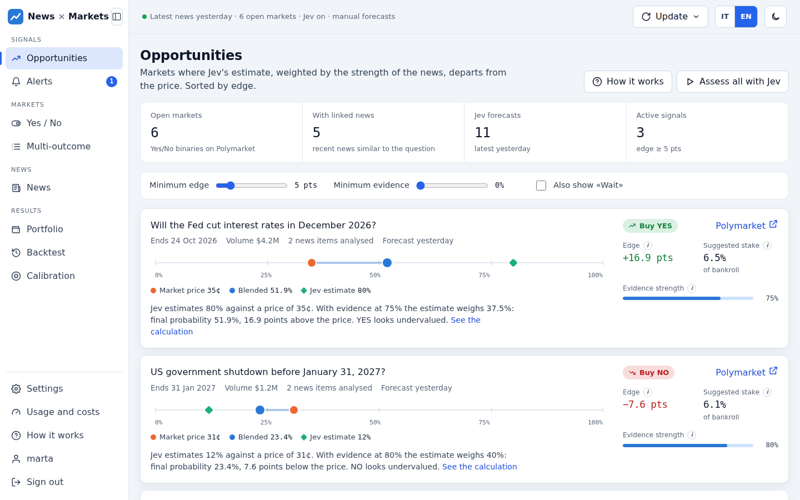
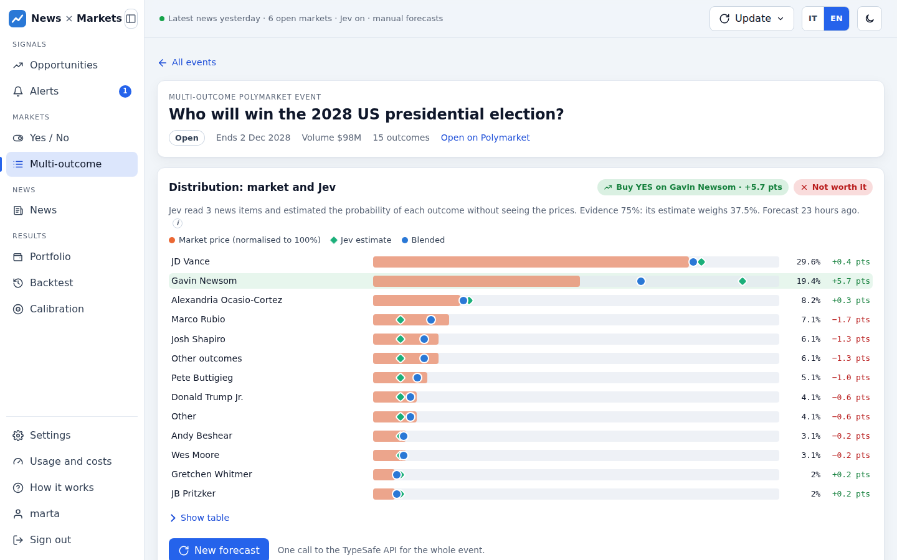
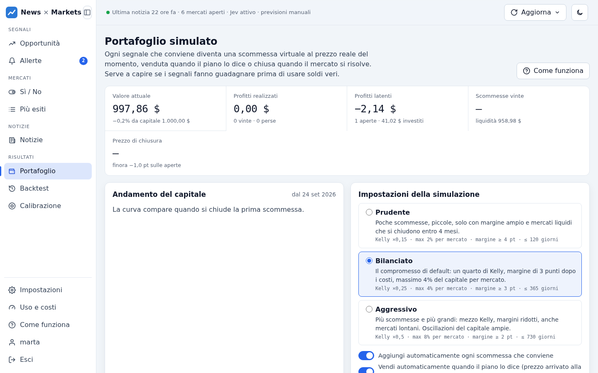
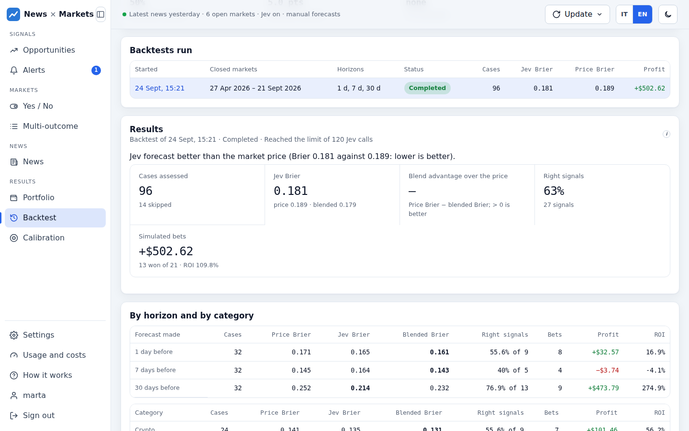
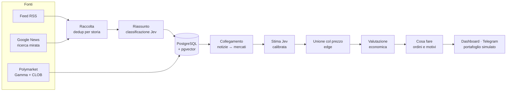

<div align="center">

# News × Markets

**Dalle notizie alle probabilità: un aggregatore di notizie che stima gli eventi quotati su [Polymarket], li confronta con il prezzo e dice cosa conviene fare.**

[](https://github.com/botta0oss/News_Aggregator/actions/workflows/tests.yml)


[Funzionalità](#funzionalità) · [Come funziona](#come-funziona) · [Avvio rapido](#avvio-rapido) · [Messa online](#messa-online) · [Documentazione](#documentazione)

<br>

<picture>
  <source media="(prefers-color-scheme: dark)" srcset="docs/images/overview-dark.png">
  
</picture>

</div>

> [!WARNING]
> **Non è consulenza finanziaria.** L'app non piazza ordini: produce indicazioni da verificare.
> Prima di usare soldi veri controlla i risultati su molti mercati risolti
> ([backtest e calibrazione](docs/verifica.md)).
>
> **L'umano parla ora:** Questa schifezza è vibecodata al 1000%, ho voluto testare Claude Code
> e Jev di TypeSafe AI per vedere le capacità di queste nuove tecnologie. Non bisogna fidarsi
> di questa webapp per prendere decisioni finanziarie o fare scommesse. Sfruttate il
> portafoglio simulato all'interno del programma se vi interessa vedere come performa.

## In breve

News × Markets raccoglie notizie da feed RSS e ricerche mirate, le classifica con
[TypeSafe Jev](https://typesafe.ai) e le collega ai mercati di Polymarket. Per ogni mercato
Jev stima la probabilità dell'esito senza vedere il prezzo; la stima, corretta con i risultati
passati e pesata per la forza delle notizie, viene confrontata con il prezzo.

Quando c'è un vantaggio, l'app lo traduce in un **piano concreto**: comprare o no, con quale
ordine limite, quanto puntare, quando vendere e **perché sì o perché no**. Un portafoglio
simulato, il backtest e la calibrazione misurano se i segnali funzionano davvero.

## Funzionalità

<table>
<tr>
<td width="50%" valign="top">

### 📰 Notizie
- Fonti RSS gestite dalla dashboard, con catalogo di fonti consigliate
- Ricerca mirata su Google News per i mercati più scambiati
- Deduplicazione per storia: conferme contate per testata, non per articolo
- Riassunti (Gemini, Groq, Ollama) e classificazione con Jev
- Ricerca full-text con evidenziazione e filtri

</td>
<td width="50%" valign="top">

### 🎯 Previsioni
- Collegamento notizie–mercati: significato (embedding multilingue) + termini chiave
- Stima indipendente di Jev, senza vedere il prezzo
- Calibrazione di Platt e unione col prezzo in log-odds
- Mercati Sì/No e **a più esiti** (elezioni, campionati), con arbitraggio segnalato
- Allerte Telegram quando una notizia anticipa il prezzo

</td>
</tr>
<tr>
<td valign="top">

### 💶 Decisioni
- Prezzo reale dal book, commissioni, incertezza, rendimento annuo
- Kelly calcolato sul book, con tre preset di rischio
- **Cosa fare**: compra, aspetta, evita, tieni o vendi, con ordini limite
- Prezzi a cui la decisione cambierebbe e regola di vendita esplicita
- Motivi a favore e contro, con un livello di fiducia

</td>
<td valign="top">

### 📊 Misura
- Portafoglio simulato con acquisti e vendite automatiche
- Backtest su mercati risolti, con notizie d'archivio senza senno di poi
- Intervalli di confidenza e validazione sui mercati più recenti
- Prezzo di chiusura (CLV) di segnali, scommesse e allerte
- Uso e costi delle API a pagamento, con limiti giornalieri

</td>
</tr>
</table>

## Uno sguardo alla dashboard

<table>
<tr>
<td width="50%" align="center">
<picture>
  <source media="(prefers-color-scheme: dark)" srcset="docs/images/strategy-dark.png">
  
</picture>
<br><b>Cosa fare</b>: ordini, prezzi e motivi
</td>
<td width="50%" align="center">
<picture>
  <source media="(prefers-color-scheme: dark)" srcset="docs/images/multi-dark.png">
  
</picture>
<br><b>Più esiti</b>: la distribuzione, esito per esito
</td>
</tr>
<tr>
<td align="center">
<picture>
  <source media="(prefers-color-scheme: dark)" srcset="docs/images/portfolio-dark.png">
  
</picture>
<br><b>Portafoglio simulato</b>: risultati prima dei soldi veri
</td>
<td align="center">
<picture>
  <source media="(prefers-color-scheme: dark)" srcset="docs/images/backtest-dark.png">
  
</picture>
<br><b>Backtest</b>: come sarebbe andata sul passato
</td>
</tr>
</table>

<sub>Screenshot con dati dimostrativi. Tema chiaro e scuro seguono le impostazioni del tuo GitHub.</sub>

## Come funziona



1. **Raccolta.** Le notizie arrivano da feed RSS e da ricerche mirate; la stessa storia
   riscritta da più testate diventa un'unica voce, con il numero di testate che la confermano.
2. **Collegamento.** Ogni mercato riceve le notizie sullo stesso soggetto, scelte per
   pertinenza, affidabilità della fonte e freschezza.
3. **Previsione.** Jev legge regole del mercato e notizie e stima la probabilità senza vedere
   il prezzo. La stima viene calibrata sui mercati già risolti e unita al prezzo con un peso
   che cresce con la forza delle notizie.
4. **Decisione.** Prezzo reale dal book, commissioni, incertezza, tempo e limiti di rischio
   dicono se conviene, quanto puntare e a che prezzo vendere.
5. **Verifica.** Portafoglio simulato, backtest, calibrazione e prezzo di chiusura dicono se
   il vantaggio è reale.

Dettagli e formule: [Il metodo](docs/metodo.md) · [Strategia e portafoglio](docs/strategia.md).

## Avvio rapido

**Con Docker** (consigliato). Serve almeno la chiave di [TypeSafe](https://typesafe.ai) per le previsioni.

```bash
git clone https://github.com/botta0oss/News_Aggregator.git && cd News_Aggregator
cp .env.example .env          # inserisci almeno TYPESAFE_API_KEY e POSTGRES_PASSWORD
docker compose up --build
docker compose exec api python -m backend.auth.cli create-user tuonome --role admin
```

Apri **http://localhost:8000** e accedi con l'utente appena creato. Il compose avvia anche
Postgres con pgvector; alla prima partenza la raccolta delle notizie e il sync dei mercati
iniziano subito. Per aprirla dal telefono o da un altro PC di casa vedi
[Uso nella rete di casa](docs/deploy.md#uso-in-locale-e-nella-rete-di-casa).

> [!TIP]
> Con una GPU NVIDIA in locale:
> `docker compose -f docker-compose.yml -f docker-compose.gpu.yml up --build`.
> Senza GPU l'immagine predefinita usa PyTorch solo CPU, molto più leggera.
> Vedi [Immagini Docker](docs/deploy.md#immagini-docker-cpu-o-gpu).

<details>
<summary><b>Senza Docker</b></summary>

<br>

Serve un PostgreSQL con l'estensione [pgvector](https://github.com/pgvector/pgvector).

```bash
python -m venv .venv && source .venv/bin/activate
pip install torch --index-url https://download.pytorch.org/whl/cpu   # solo senza GPU
pip install -r requirements.txt
cp .env.example .env        # imposta DATABASE_URL e le chiavi
python -m backend.auth.cli create-user tuonome --role admin
uvicorn backend.main:app --reload
```

`python scripts/check_env.py` controlla quali chiavi sono configurate e se il database
risponde. Le tabelle vengono create all'avvio e aggiornate da migrazioni idempotenti.

</details>

## Messa online

Il modo più economico: un piccolo VPS con Docker e **Cloudflare Tunnel** per l'HTTPS, senza
porte aperte né certificati da gestire. Il compose include il tunnel e un backup giornaliero
del database.

| | Costo indicativo |
|---|---|
| VPS 2 vCore, 4 GB RAM (OVH VPS-1, Hetzner…) | circa 4–6 € al mese |
| Cloudflare Tunnel, HTTPS, dominio gestito da Cloudflare | gratuito (il dominio si paga a parte) |
| Riassunti con Gemini o Groq, Telegram, Polymarket, Google News | piani gratuiti |
| Previsioni con Jev (TypeSafe) | a consumo, con [limiti giornalieri](docs/costi.md) |

Guida passo passo: **[Deploy su un VPS con Cloudflare Tunnel](docs/deploy.md#deploy-su-un-vps-con-cloudflare-tunnel)**.

## Configurazione essenziale

Tutto si imposta in `.env` (copia di [`.env.example`](.env.example)). Le più importanti:

| Variabile | A cosa serve |
|---|---|
| `TYPESAFE_API_KEY` | Previsioni e classificazione con Jev. Senza, classificazione euristica e niente previsioni |
| `GEMINI_API_KEY` / `GROQ_API_KEY` | Riassunti delle notizie (piani gratuiti) |
| `POSTGRES_PASSWORD` | Password del database nel compose, da scegliere prima del primo avvio |
| `DAILY_JEV_CALL_LIMIT`, `DAILY_AI_BUDGET_USD` | Tetto giornaliero alle chiamate e alla spesa |
| `PREDICTION_AUTO` | Previsioni automatiche dopo ogni raccolta (di base spente) |
| `TELEGRAM_BOT_TOKEN`, `TELEGRAM_CHAT_ID` | Notifiche delle allerte |
| `PUBLIC_URL` | Indirizzo della dashboard, per i link nelle notifiche |

Tutte le altre: **[Configurazione](docs/configurazione.md)**.

## Documentazione

| Pagina | Contenuto |
|---|---|
| [Guida alla dashboard](docs/guida.md) | Le pagine, il flusso di lavoro consigliato, cosa fare se la dashboard non si apre |
| [Il metodo](docs/metodo.md) | Raccolta, collegamento notizie–mercati, previsione, mercati a più esiti |
| [Strategia e portafoglio](docs/strategia.md) | Valutazione economica, cosa fare e quando vendere, portafoglio simulato |
| [Allerte](docs/allerte.md) | Notifiche Telegram e misura del loro anticipo sul prezzo |
| [Backtest e calibrazione](docs/verifica.md) | Quanto fidarsi delle previsioni, sul passato e sul presente |
| [Uso e costi](docs/costi.md) | Chiamate a pagamento, stima dei costi, limiti giornalieri |
| [Configurazione](docs/configurazione.md) | Tutte le variabili di `.env` |
| [Accesso e sicurezza](docs/sicurezza.md) | Utenti e ruoli, sessioni, protezioni |
| [Deploy](docs/deploy.md) | Immagini CPU/GPU, uso in locale e nella rete di casa, VPS con Cloudflare Tunnel, backup |
| [API](docs/api.md) | Gli endpoint REST |
| [Sviluppo e test](docs/sviluppo.md) | Test, CI, struttura del codice |

## Tecnologie

| Livello | Strumenti |
|---|---|
| Backend | FastAPI, SQLAlchemy async + asyncpg, APScheduler |
| Dati | PostgreSQL 16 con pgvector |
| Modelli | TypeSafe Jev (previsioni e classificazione), sentence-transformers `paraphrase-multilingual-MiniLM-L12-v2` (embedding), Gemini / Groq / Ollama (riassunti) |
| Frontend | HTML, CSS e JavaScript senza dipendenze né build, tema chiaro e scuro, accessibile da tastiera |
| Infrastruttura | Docker (CPU o CUDA), Cloudflare Tunnel, GitHub Actions |

## Limiti noti

- **Nessuna esecuzione di ordini.** Per piazzarli servirebbero l'API CLOB di Polymarket, un
  wallet e la firma degli ordini. Il portafoglio è solo simulato e ipotizza di comprare al
  book del momento senza muovere il mercato oltre la profondità letta.
- **Commissioni.** Il tasso dipende dalla categoria e l'endpoint `/fee-rate` dice solo se un
  mercato ne è esente: la documentazione di Polymarket e la sua API non coincidono.
- **Soglie di similarità** tarate sul modello di embedding precedente: con quello multilingue
  vanno verificate sui propri dati.
- **Ricerca mirata via Google News RSS**: servizio non ufficiale, senza garanzie; i risultati
  hanno solo titolo e testata.
- **Nessun recupero password via email**: un admin la reimposta con
  `python -m backend.auth.cli set-password`.

[Polymarket]: https://polymarket.com
