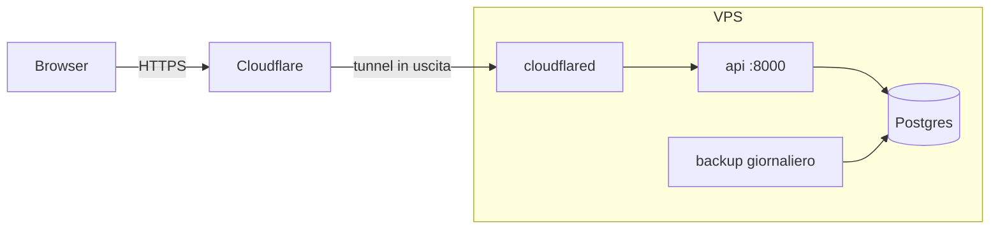

# Deploy

<sub>[← Torna al README](../README.md) · [Tutta la documentazione](README.md)</sub>

Immagini Docker per CPU e GPU e messa online su un VPS con Cloudflare Tunnel.

## Immagini Docker: CPU o GPU

Ci sono due immagini:

| File | Per | Note |
|---|---|---|
| `Dockerfile` (predefinito) | Server, VPS, macchine ARM, PC senza GPU NVIDIA | PyTorch solo CPU: immagine molto più piccola e build più veloce |
| `Dockerfile.cuda` | PC con GPU NVIDIA | PyTorch con CUDA; gli embedding vengono calcolati sulla GPU |

Per usare la GPU (serve il driver NVIDIA e l'[NVIDIA Container Toolkit](https://docs.nvidia.com/datacenter/cloud-native/container-toolkit/latest/install-guide.html) sull'host, solo x86_64):

```bash
docker compose -f docker-compose.yml -f docker-compose.gpu.yml up --build
```

Nel log all'avvio, `Embedding model ... on cuda:0` conferma che la GPU è in uso (`on cpu`
altrimenti). Le due immagini hanno nomi diversi (`news-aggregator-api:cpu` e `:cuda`), quindi
si può passare dall'una all'altra senza ricostruire ogni volta. Per un server la GPU non serve:
il modello è piccolo e gli articoli arrivano a gruppi.

## Deploy su un VPS con Cloudflare Tunnel

Il modo più economico per tenerla online: un piccolo VPS (per esempio OVH VPS-1 o Hetzner:
2 vCore, 4 GB di RAM bastano) con Docker, e **Cloudflare Tunnel** per l'HTTPS. Il tunnel
esce dal server verso Cloudflare: nessuna porta da aprire, nessun certificato da gestire,
l'indirizzo IP del server resta nascosto. Serve un dominio gestito da Cloudflare (piano
gratuito); il tunnel è gratuito.



**1. Il server.** Ubuntu 24.04, accesso SSH con chiave. Firewall con la sola porta SSH aperta:

```bash
sudo apt update && sudo apt upgrade -y
sudo ufw allow OpenSSH && sudo ufw enable
```

La porta 8000 dell'app ascolta solo su `127.0.0.1` (`API_BIND`): Docker aggira `ufw` per le
porte pubblicate, per questo non viene pubblicata sulla rete.

**2. Docker e il codice.**

```bash
curl -fsSL https://get.docker.com | sh
sudo usermod -aG docker $USER      # poi esci e rientra
git clone https://github.com/botta0oss/News_Aggregator.git && cd News_Aggregator
cp .env.example .env
```

**3. Il tunnel.** Nella dashboard di Cloudflare: *Zero Trust → Networks → Tunnels → Create a
tunnel → Cloudflared*, dagli un nome e copia il **token** (la lunga stringa dopo `--token` nel
comando di installazione proposto: non serve eseguirlo, `cloudflared` gira già nel compose).
Poi aggiungi un *Public hostname*: sottodominio a scelta (es. `news.tuodominio.it`), tipo
**HTTP**, URL **`api:8000`**.

**4. Il file `.env`.** Oltre alle chiavi delle API:

| Variabile | Valore |
|---|---|
| `POSTGRES_PASSWORD` | Una password casuale, prima del primo avvio: `openssl rand -hex 24` |
| `COMPOSE_PROFILES` | `tunnel,backup` |
| `CLOUDFLARE_TUNNEL_TOKEN` | Il token del passo 3 |
| `CLIENT_IP_HEADER` | `CF-Connecting-IP` (IP reale dei visitatori per i limiti di accesso) |
| `PUBLIC_URL` | `https://news.tuodominio.it` (link nelle notifiche Telegram) |
| `API_DOCS_ENABLED` | `false` |
| `ADMIN_USERNAME`, `ADMIN_PASSWORD` | Il primo amministratore; dopo il primo avvio togli la password dal file |
| `DAILY_JEV_CALL_LIMIT`, `DAILY_AI_BUDGET_USD` | Un tetto alla spesa per le chiamate a pagamento |

**5. Avvio.**

```bash
docker compose up -d --build        # la prima build scarica il modello: qualche minuto
docker compose logs -f api tunnel   # attendi "Application startup complete" e "Registered tunnel connection"
```

La dashboard è su `https://news.tuodominio.it`. Per un livello di protezione in più, *Zero Trust
→ Access* può chiedere un codice via email prima ancora della pagina di login (gratuito fino a
50 utenti).

**Aggiornare** all'ultima versione (dati e backup restano):

```bash
./scripts/update.sh
```

**Backup.** Con il profilo `backup` ogni giorno viene salvato un dump in `./backups`, tenuto per
`BACKUP_KEEP_DAYS` giorni. È sullo stesso disco del database: copialo anche fuori dal server
(per esempio con `rclone` su Cloudflare R2, o scaricandolo con `scp`), oppure attiva i backup
del VPS offerti dal provider. Per ripristinarne uno:

```bash
docker compose stop api
docker compose exec -T db pg_restore -U postgres -d postgres --clean --if-exists < backups/newsagg-AAAAMMGG-HHMM.dump
docker compose start api
```

**Se qualcosa non va.**
- *Errore 502 o 1033 da Cloudflare*: l'app non risponde ancora (al primo avvio carica il
  modello) o il tunnel non è connesso: `docker compose logs api tunnel`.
- *Il tunnel non si connette*: token sbagliato, o nel *Public hostname* l'URL non è `api:8000`.
- *Password del database cambiata dopo il primo avvio*: il database tiene quella vecchia.
  Aggiornala anche lì: `docker compose exec db psql -U postgres -c "ALTER USER postgres PASSWORD 'nuova'"`.
