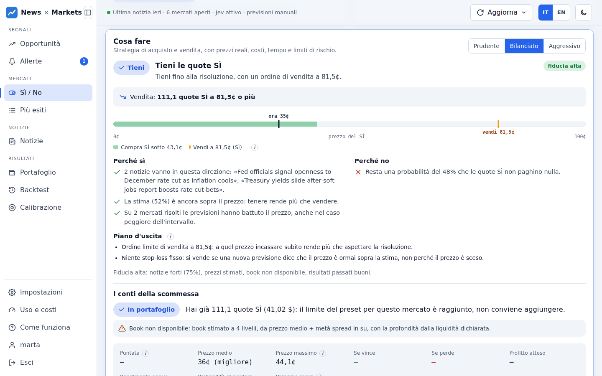

# Guida alla dashboard

[← Torna al README](../../README.it.md) · [Tutta la documentazione](README.md) · [English](../guide.md)

Le pagine della dashboard, il flusso di lavoro consigliato e cosa fare se non si apre.

## Dashboard

L'interfaccia web è servita dalla stessa app su `/`: HTML, CSS e JavaScript senza
dipendenze né build, nella cartella `frontend/`.

**Navigazione.** Le sezioni sono raggruppate per quello che si sta facendo: *Segnali*
(Opportunità, Allerte), *Mercati* (Sì / No, Più esiti), *Notizie*, *Risultati* (Portafoglio, Backtest, Calibrazione).
Impostazioni, Uso e costi, «Come funziona» e account stanno in fondo.
- **Da 1024 px in su:** menu laterale, che si può ridurre alle sole icone; la scelta viene
  ricordata. In alto una riga di stato (ultima notizia, mercati aperti, Jev attivo) e il menu
  «Aggiorna» con gli aggiornamenti di notizie e mercati (solo admin).
- **Su tablet e telefono:** barra in basso con le quattro sezioni più usate e «Altro» per
  tutte le altre.
- Il numero su «Allerte» indica le opportunità delle ultime 24 ore.

**Lingua.** Il pulsante **IT / EN** in alto a destra, accanto a quello del tema, passa tutta la
dashboard dall'italiano all'inglese. La scelta viene ricordata nel browser; alla prima visita
la dashboard segue la lingua del browser. Numeri, date e importi seguono la lingua
(`1,5 $` / `$1.5`), e così i testi che il server scrive per la dashboard (piani, motivi,
messaggi d'errore).

| Sezione | Cosa mostra |
|---|---|
| **Opportunità** | Mercati con segnale attivo ordinati per edge: prezzo, stima Jev e probabilità blended sulla stessa scala 0–100 %, puntata suggerita e forza delle evidenze. Filtri per edge ed evidenze minime. |
| **Mercati** | Tabella dei mercati con ricerca e ordinamento (clic sulle colonne o menu «Ordina per»): prezzo in centesimi, volume, liquidità, scadenza con giorni mancanti, notizie collegate, ultimo segnale ed edge. |
| **Più esiti** | Eventi con più risposte possibili (elezioni, campionati, premi) come distribuzione: barra del prezzo per ogni esito, stima di Jev e blended, edge per esito, segnale sull'esito più lontano dal prezzo (SÌ se sottovalutato, NO se sopravvalutato), badge di arbitraggio. |
| **Dettaglio mercato** | La scheda **Cosa fare** (azione, ordini limite, scala dei prezzi, motivi a favore e contro, piano d'uscita, conti della scommessa), ultima previsione e pulsante per chiederne una nuova, storico (prezzo contro blended), notizie collegate con rilevanza e impatto, regole di risoluzione. |
| **Portafoglio** | Portafoglio simulato: valore, profitti realizzati e latenti, prezzo di chiusura, curva del capitale, posizioni aperte con il loro piano (tieni o vendi), scommesse chiuse o vendute, preset di rischio, acquisti e vendite automatiche, esclusioni. |
| **Notizie** | Ricerca nelle notizie (titolo, testo, riassunto) con parole evidenziate; filtri per fonte, periodo, regione, categoria, rilevanza per i mercati, opinioni; ordinamento per pertinenza, punteggio o data. |
| **Allerte** | Ultime allerte con notizia, prezzo all'allerta e movimento a favore dopo 15 minuti, 1, 6 e 24 ore; risultati complessivi; impostazioni (categorie, soglie, limite giornaliero, ore silenziose, prova di Telegram). |
| **Backtest** | Jev sui mercati già risolti, con notizie e prezzo di allora: Brier contro il prezzo, per orizzonte e categoria, calibrazione, scommesse simulate, parametri suggeriti da applicare. |
| **Calibrazione** | Brier score di prezzo, Jev e blended sui mercati risolti con intervallo di confidenza, e prezzo di chiusura dei segnali (il prezzo si è mosso nella direzione giusta?). |
| **Uso e costi** | Chiamate alle API a pagamento per giorno e per funzione, costo stimato, limiti giornalieri modificabili. |
| **Come funziona** | Il metodo passo per passo con i parametri reali del server, un esempio numerico e un glossario. |
| **Impostazioni** | Fonti: aggiungi (con prova del feed prima di salvare), modifica, attiva/disattiva, aggiorna subito, elimina; fonti consigliate dal catalogo; riclassificazione; parametri di previsione in sola lettura. |

<picture>
  <source media="(prefers-color-scheme: dark)" srcset="../images/it/strategy-dark.png">
  
</picture>

Nel dettaglio di un mercato la scheda **Perché questo segnale** mostra il calcolo completo
sui numeri di quella previsione: stima Jev, peso, probabilità blended, edge, controlli
superati e puntata. I termini tecnici hanno una definizione al passaggio del mouse (ⓘ).

La ricerca accetta frasi tra virgolette, `-parola` per escludere e `or` per alternative;
l'ultima parola vale anche come prefisso. Il link `#/notizie?q=...` riapre la stessa ricerca.

Il menu «Aggiorna» avvia l'aggiornamento di notizie e mercati. La pagina si aggiorna da sola
mentre il lavoro procede in background.

**Valuta tutti con Jev** (in Opportunità e Mercati, solo admin) chiede una previsione per
ogni mercato aperto con notizie recenti collegate. Prima di partire mostra quante chiamate a
pagamento servono e quanto tempo richiedono con il limite `JEV_RPM`. Puoi valutare tutti
i mercati o solo quelli mai valutati o con notizie nuove dall'ultima previsione.

Il lavoro gira in background: puoi chiudere la pagina e ritrovare l'avanzamento quando
torni. Aggiorna prima prezzi e collegamenti, così l'edge è calcolato sul prezzo attuale.
Se Jev risponde con un limite di frequenza, aspetta e riprende dallo stesso mercato.
Si ferma da solo dopo 3 errori consecutivi, ad esempio per connessione assente o chiave
non valida, e si può interrompere quando vuoi. Le scommesse simulate seguono le regole
del portafoglio.

Scelte di design:
- **Tema scuro predefinito**, con tema chiaro dal pulsante in alto. La scelta viene ricordata.
- **Colori fissi per ogni serie in tutti i grafici:** prezzo arancio, Jev acqua, blended blu. Verde e rosso sono riservati ai segnali e sono sempre accompagnati da icona e testo.
- **Palette verificata** per il daltonismo su entrambi i temi.
- **Forme distinte:** cerchio e rombo, linea continua e tratteggiata. Ogni grafico ha legenda con valori e tabella alternativa.
- **Numeri in carattere monospazio** (Fira Code) e prezzi in centesimi, come su Polymarket.
- **Accessibilità:** navigabile da tastiera, target touch di 44 px, rispetta la riduzione del movimento, nessuno scroll orizzontale da 320 px in su.

## Flusso di lavoro consigliato

1. Avvia l'app: la prima raccolta e il sync dei mercati partono subito.
2. Guarda quali mercati hanno notizie collegate:
   `GET /markets?only_linked=true`
3. Controlla che le notizie siano pertinenti: `GET /markets/{id}`. Se i collegamenti sono
   rumorosi alza `MARKET_MATCH_THRESHOLD`, se sono troppo pochi abbassala. Nel dettaglio del
   mercato «Cerca notizie» lancia subito la ricerca mirata.
4. Chiedi una previsione sui mercati che ti interessano (`POST /markets/{id}/predict`),
   oppure su tutti con **Valuta tutti con Jev** (`POST /markets/predict-all`)
5. Consulta le opportunità: `GET /predictions/opportunities?min_edge=0.08`
6. Quando i risultati convincono, attiva `PREDICTION_AUTO=true`, tenendo d'occhio i costi
   con `PREDICTION_MAX_PER_RUN`.
7. Lascia lavorare il portafoglio simulato per decine di mercati risolti. Prima di usare
   soldi veri controlla che il risultato reale sia positivo e vicino a quello atteso.

## Se la dashboard non si apre

Se la pagina resta vuota con solo il logo, il JavaScript dell'app non è partito. Dopo 8
secondi la pagina lo dice e propone di ricaricarla.

1. **Ricarica forzata** (Ctrl+F5 o Cmd+Shift+R). Dopo un aggiornamento il browser può avere
   in cache file vecchi; ora i file della dashboard sono serviti con `Cache-Control: no-cache`,
   quindi dal prossimo aggiornamento non dovrebbe più succedere.
2. **Se persiste**, apri gli strumenti per sviluppatori del browser (F12 → Console e Rete) e
   controlla i log del container: una richiesta che non risponde indica un server bloccato.
